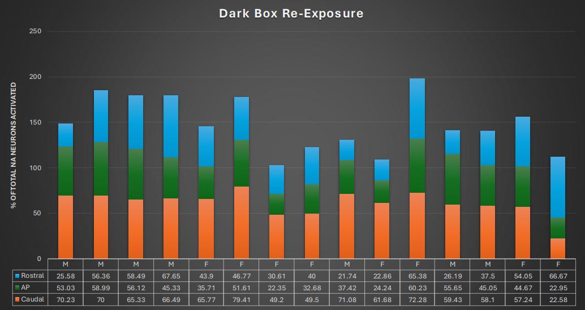
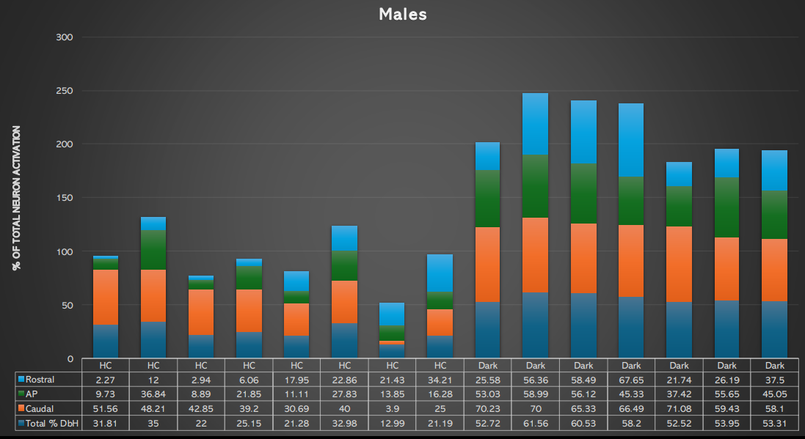
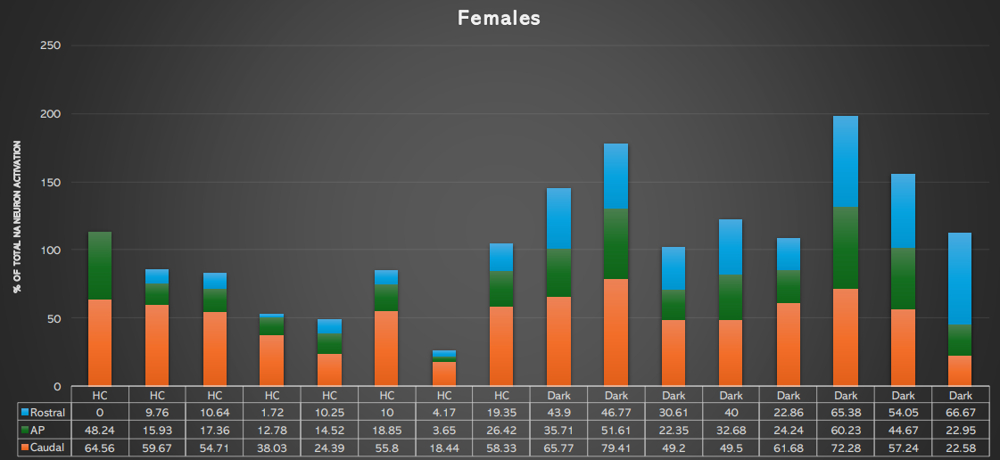
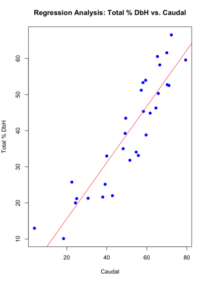
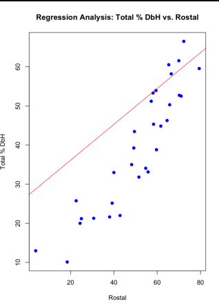
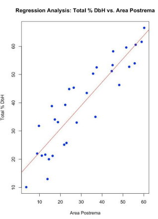

# Activation Patterns of A2 Noradrenergic Neurons in Fear-Conditioned Rats

## Project Overview
This repository contains the R code and datasets for analyzing the activation of A2 noradrenergic neurons in the nucleus of the solitary tract (NTS) of rats subjected to fear conditioning. The study focuses on dopamine β-hydroxylase (DbH) neurons, examining differences in activation under various conditions.

**Highlights**

- **Innovative Analytical Techniques**: Employed advanced statistical models to dissect complex neural activation patterns, setting a new standard for precision in neuroscientific research.
- **Interdisciplinary Collaboration**: This study was enriched by collaboration between neuroscientists at Florida State University and statisticians at Rush University, illustrating the power of interdisciplinary approaches in tackling complex biological questions.
- **Impactful Visualizations**: Developed and shared a series of detailed graphs and models that communicate our findings, making complex data understandable and engaging for a broad audience.
- **Broader Implications**: Discussed the implications of our findings for developing new therapeutic strategies for anxiety and stress-related disorders, highlighting the potential for real-world applications.
- **Future Research Directions**: Outlined next steps for further research, potentially opening new avenues for exploring how environmental factors influence neurological and behavioral responses.

## Research and Data Origin

### Data Collection
The experimental data for this study on A2 noradrenergic neuron activation were collected at Florida State University. These experiments focused on understanding the neurological responses of rats subjected to various environmental conditions. For more details on the experimental setup and methodologies, refer to the published article linked below:
- [Research Article on ScienceDirect](https://www.sciencedirect.com/science/article/abs/pii/S0031938421002018)

### Data Analysis
The data analysis was conducted by Gitika Bhardwaj and Tyla Dolezel at Rush University, utilizing the R programming language. We applied sophisticated statistical methods to uncover underlying patterns and reach meaningful conclusions regarding the activation of dopamine β-hydroxylase (DbH) neurons under fear conditioning stimuli.

## Project Structure
- **/data/**: Contains instructions and links for accessing the datasets used in the analyses. Data collection was performed at Florida State University, with further details and findings available in the linked research article.
- **/scripts/**: Contains R scripts developed for data processing, analysis, and visualization. The statistical analysis was carried out at Rush University.
- **/results/**: Includes output files and visualizations generated from the R scripts.

## Data Description
The data is derived from experimental observations on rat neuron activation under different environmental exposures, collected through specific methods. Key variables include:
- `Total_DbH`: Percentage of DbH activation.
- `Re_exposure`: Environmental condition ('Dark' or 'Home Cage').

## Files and Directories
- `DbH.csv`: Dataset with the experimental results.
- `analysis.R`: R script for statistical analysis and generating visualizations.

## Requirements
This project uses R with packages like `ggplot2`, `dplyr`, and `tidyr`. Install them using:
```bash
install.packages(c("ggplot2", "dplyr", "tidyr"))
```

## Usage 
To run the analysis:
1. Ensure that R and all required packages are installed.
2. Execute the script via command line:
   ```bash
   Rscript analysis.R
   
## Key Findings

### Statistical Significance
Our findings show a statistically significant higher activation of DbH neurons in the Dark group compared to the Home Cage group, with a p-value less than 0.0001. This indicates a strong association between the environmental exposure and neuron activation levels.

### Power Analysis
Our analysis demonstrated robust statistical power (0.899) to detect significant effects, supporting the reliability of our results. This high level of power ensures that the probability of a Type II error (failing to detect a true effect when one exists) is minimized.

## Descriptive Statistics and Roles in Neuron Activation

### Descriptive Statistics: Re-Exposure
The following graph shows the percentage of neuron activation in the dark box re-exposure scenario, highlighting differences between male and female subjects.



### Descriptive Statistics by Sex
These separate graphs for males and females highlight differences in the neuron activation response to the same environmental stimuli. This visualization helps in understanding sex-specific neurological mechanisms and their implications in stress-related behaviors.





### Regression Analysis
The series of graphs produced from regression analysis demonstrate how neuron activation correlates with different brain regions:
  - **Caudal Region Graph**: Shows a strong correlation indicating that this region is a major driver of overall neuron activation.
    

  - **Rostral and AP Region Graphs**: These graphs help in understanding their roles, albeit less significant than the caudal region, in modulating neuron activity during fear conditioning.
    



## Regression Analysis Insights

### Predictive Roles
- **Caudal Region**: Identified as the strongest predictor of total neuron activation, emphasizing its crucial role in stress response regulation.
- **Rostral and AP Regions**: Although these regions have a less potent effect, they play critical roles in modulating stress and fear responses within the organism.

### Model Strength
Our regression model demonstrates a high explanatory power, with a Multiple R-squared value of 0.9774. This indicates that our model explains a significant portion of the variance in neuron activation among the studied subjects.

### Implications of Findings

The research outcomes provide significant insights into the neural dynamics associated with environmental stress and fear, which have both scientific and practical implications:

- **Advancements in Neuroscientific Understanding**: Our findings deepen the understanding of how different brain regions respond to stress and fear stimuli, potentially reshaping existing theories in neurobiology about stress responses and fear conditioning.

- **Development of Therapeutic Strategies**: By identifying the key regions involved in stress responses, this study paves the way for developing targeted therapies that could more effectively treat anxiety disorders and stress-related conditions. Modulating activity in these critical regions could lead to breakthroughs in how we treat or manage fear-related disorders.

- **Behavioral and Psychological Insights**: The study also has implications for understanding behavioral responses to fear, which can aid psychologists and behavioral scientists in developing better interventions for managing stress and anxiety in various environments.

- **Policy and Environmental Recommendations**: Given the impact of environmental conditions on neural responses, our study could influence policies or guidelines for animal welfare, particularly in how animals are housed and managed in research settings to reduce undue stress or fear.

### Future Directions

Building on the insights garnered from this study, several promising avenues for future research can be considered:

- **Exploration of Longitudinal Effects**: Future studies could examine the long-term effects of repeated exposure to fear-inducing environments on neuron activation to understand if and how neuronal response changes over time or with repeated exposure.

- **Genetic Influences on Neuron Activation**: Investigating genetic factors that may influence the activation of A2 noradrenergic neurons could provide deeper insights into the biological underpinnings of fear responses and potentially reveal targets for genetic interventions.

- **Cross-Species Analysis**: Extending this research to other species could help determine if the patterns observed in rats are consistent across mammals, which would enhance the generalizability of the findings and their applicability to human treatments.

- **Development of Therapeutic Interventions**: Based on the regions identified as critical in neuron activation, future research could focus on developing pharmacological or non-pharmacological interventions that specifically target these areas to manage anxiety and stress-related disorders more effectively.

- **Integration with Behavioral Studies**: Combining the current findings with behavioral analyses could provide a more comprehensive understanding of how changes in neuron activation affect behavior. This could be particularly useful in developing behavioral interventions that could complement or enhance the effectiveness of medical treatments.

- **Technological Advancements in Measurement**: Employing newer technologies or methodologies for measuring neuron activation could refine the accuracy of data collection and provide more nuanced insights into the dynamics of neuronal activity under stress.

These future research paths not only aim to expand the scientific knowledge base but also seek practical applications that could significantly improve the management and treatment of conditions related to fear and stress.

## Acknowledgements
We extend our gratitude to the research teams at Florida State University for their invaluable role in conducting the detailed experiments that form the basis of this analysis. Their dedication has been crucial in advancing the scientific community's understanding of neuronal responses to fear conditioning. Special thanks to Tyla Dolezel for her contributions to the research at Florida State University and statistical analysis at Rush University.

## Contact
For more information, potential collaborations, or discussions about the implications of our findings, feel free to reach out:

- **Email**: [gita.bhardwaj1@gmail.com](mailto:gita.bhardwaj1@gmail.com)
- **LinkedIn**: [Insert LinkedIn Profile](https://linkedin.com/in/yourprofile)


```
